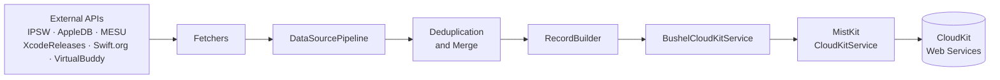
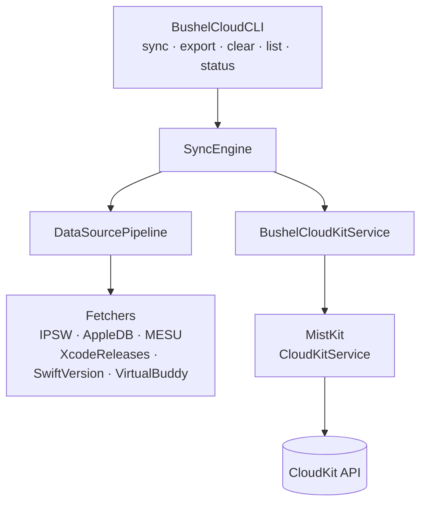
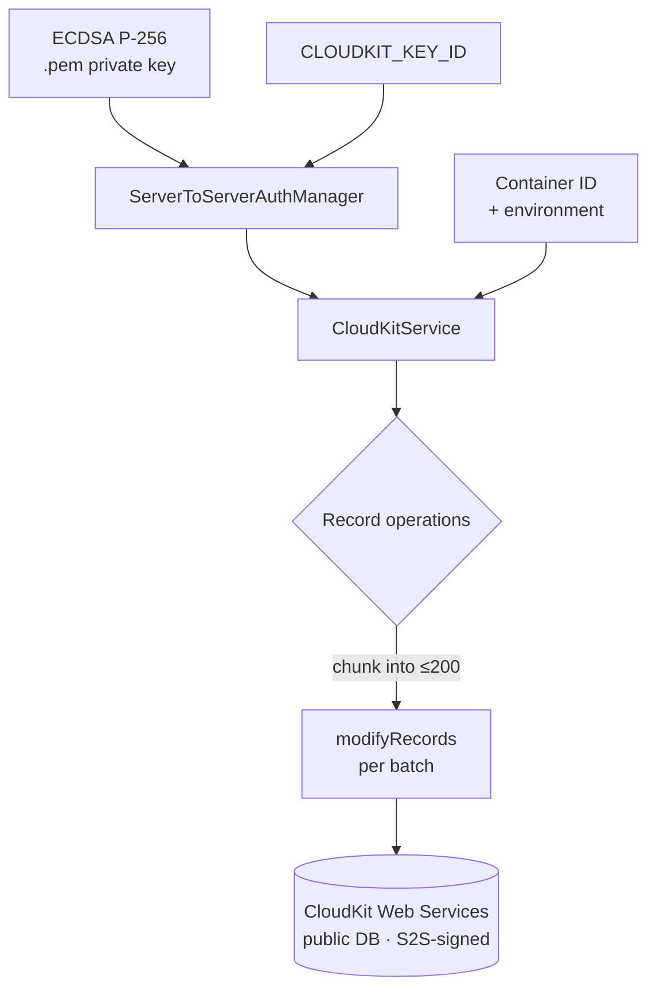
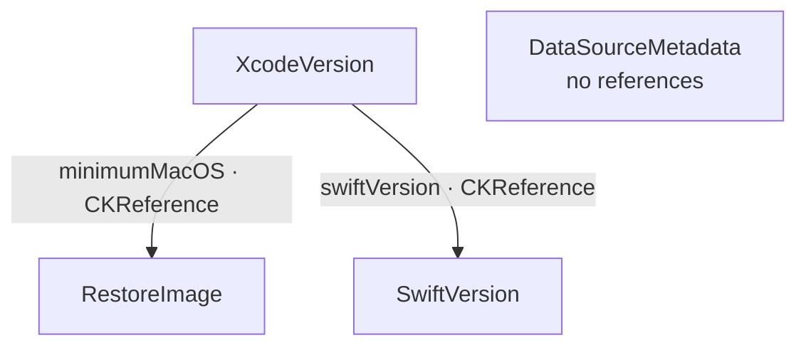

# Bushel Demo - CloudKit Data Synchronization

[](https://github.com/brightdigit/BushelCloud/actions/workflows/BushelCloud.yml)
[](https://codecov.io/gh/brightdigit/BushelCloud)
[](https://github.com/realm/SwiftLint)
[](https://swift.org)
[](https://swift.org)
[](https://opensource.org/licenses/MIT)

A command-line tool demonstrating MistKit's CloudKit Web Services capabilities by syncing macOS restore images, Xcode versions, and Swift compiler versions to CloudKit.

> 📖 **Tutorial-Friendly Demo** - This example is designed for developers learning CloudKit and MistKit. Use the `--verbose` flag to see detailed explanations of CloudKit operations and MistKit usage patterns.

## 🎓 What You'll Learn

This demo teaches practical CloudKit development patterns:

- ✅ **Server-to-Server Authentication** - How to authenticate CloudKit operations from command-line tools and servers
- ✅ **Batch Record Operations** - Handling CloudKit's 200-operation-per-request limit efficiently
- ✅ **Record Relationships** - Using CKReference to create relationships between records
- ✅ **Multi-Source Data Integration** - Fetching, deduplicating, and merging data from multiple APIs
- ✅ **Modern Swift Patterns** - async/await, Sendable types, and Swift 6 concurrency

**New to CloudKit?** Start with the [Quick Start Guide](#quick-start) below, then explore verbose mode to see how everything works under the hood.

## Overview

Bushel is a comprehensive demo application showcasing how to use MistKit to:

- Fetch data from multiple sources (ipsw.me, AppleDB.dev, xcodereleases.com, swift.org, MESU, Mr. Macintosh)
- Transform data into CloudKit-compatible record structures
- Batch upload records to CloudKit using the Web Services REST API
- Handle relationships between records using CloudKit References
- Export data for analysis or backup

## What is "Bushel"?

In Apple's virtualization framework, **restore images** are used to boot virtual Macintosh systems. These images are essential for running macOS VMs and are distributed through Apple's software update infrastructure. Bushel collects and organizes information about these images along with related Xcode and Swift versions, making it easier to manage virtualization environments.

## Architecture

### Data Flow

The sync pipeline moves version data from external APIs into CloudKit in three phases — **fetch** (parallel API calls), **transform** (deduplicate and resolve references), and **upload** (batched writes):



### Data Sources

The demo integrates with multiple data sources to gather comprehensive version information:

1. **IPSW.me API** (via [IPSWDownloads](https://github.com/brightdigit/IPSWDownloads))
   - macOS restore images for VirtualMac2,1
   - Build numbers, release dates, signatures, file sizes

2. **AppleDB.dev**
   - Comprehensive macOS restore image database
   - Device-specific signing status
   - VirtualMac2,1 compatibility information
   - Maintained by LittleByte Organization

3. **XcodeReleases.com**
   - Xcode versions and build numbers
   - Release dates and prerelease status
   - Download URLs and SDK information

4. **Swift.org**
   - Swift compiler versions
   - Release dates and download links
   - Official Swift toolchain information

5. **Apple MESU Catalog** (Mobile Equipment Software Update)
   - Official macOS restore image catalog
   - Asset metadata and checksums

6. **Mr. Macintosh's Restore Image Archive**
   - Historical restore image information
   - Community-maintained release data

### Components

```text
BushelCloud/
├── DataSources/           # Data fetchers for external APIs
│   ├── IPSWFetcher.swift
│   ├── XcodeReleasesFetcher.swift
│   ├── SwiftVersionFetcher.swift
│   ├── MESUFetcher.swift
│   ├── MrMacintoshFetcher.swift
│   └── DataSourcePipeline.swift
├── Models/                # Data models
│   ├── RestoreImageRecord.swift
│   ├── XcodeVersionRecord.swift
│   └── SwiftVersionRecord.swift
├── CloudKit/              # CloudKit integration
│   ├── BushelCloudKitService.swift
│   ├── RecordBuilder.swift
│   └── SyncEngine.swift
└── Commands/              # CLI commands
    ├── BushelCloudCLI.swift
    ├── SyncCommand.swift
    └── ExportCommand.swift
```

The modules interact as follows — the CLI drives `SyncEngine`, which fans out to the data pipeline for fetching and to the service layer for uploading:



### MistKit Integration Pattern

BushelCloud authenticates with **Server-to-Server** credentials (no signed-in iCloud user). An ECDSA P-256 `.pem` key and key ID build a `ServerToServerAuthManager`, which is injected into `CloudKitService`. The database scope is chosen per call (`.public(.prefers(.serverToServer))`), and writes are chunked to CloudKit's 200-operations-per-request limit:



### BushelKit Integration

BushelCloud uses [BushelKit](https://github.com/brightdigit/BushelKit) as its modular foundation, providing:

**Core Modules:**
- **BushelFoundation** - Domain models (RestoreImageRecord, XcodeVersionRecord, SwiftVersionRecord)
- **BushelUtilities** - Formatting helpers, JSON decoding, console output
- **BushelLogging** - Unified logging abstractions

**Current Integration:**
- Git subrepo at `Packages/BushelKit/` for rapid development
- Local path dependency during migration phase

**Future:**
- After BushelKit v2.0 stable release → versioned remote dependency
- BushelKit will support VM management features

**Documentation:** [BushelKit Docs](https://docs.getbushel.app/docc)

## Features Demonstrated

### MistKit Capabilities

✅ **Public API Usage**
- Uses only public MistKit APIs (no internal OpenAPI types)
- Demonstrates proper abstraction layer design

✅ **Record Operations**
- Creating records with `RecordOperation.create()`
- Batch operations with `modifyRecords()`
- Proper field value mapping with `FieldValue` enum

✅ **Data Type Support**
- Strings, integers, booleans, dates
- CloudKit References (relationships between records)
- Proper date/timestamp conversion (milliseconds since epoch)

✅ **Batch Processing**
- CloudKit's 200-operation-per-request limit handling
- Progress reporting during sync
- Error handling for partial failures

✅ **Authentication**
- Server-to-Server Key authentication with `ServerToServerAuthManager`
- ECDSA P-256 private key signing
- Container and environment configuration

### Swift 6 Best Practices

✅ **Strict Concurrency**
- All types conform to `Sendable`
- Async/await throughout
- No data races

✅ **Modern Error Handling**
- Typed errors with `CloudKitError`
- Proper error propagation with `throws`

✅ **Value Semantics**
- Immutable structs for data models
- No reference types in concurrent contexts

## Quick Start

### Prerequisites

1. **CloudKit Container** - Create a container in CloudKit Dashboard
2. **Server-to-Server Key** - Generate from CloudKit Dashboard → API Access
3. **Private Key File** - Download the `.pem` file when creating the key

For detailed setup instructions, run `swift package generate-documentation` and view the CloudKit Setup guide in the generated documentation.

### Building

```bash
# From Bushel directory
swift build

# Run the demo
.build/debug/bushel-cloud --help
```

### First Sync (Learning Mode)

Run with `--verbose` to see educational explanations of what's happening:

```bash
export CLOUDKIT_KEY_ID="YOUR_KEY_ID"
export CLOUDKIT_PRIVATE_KEY_PATH="./path/to/private-key.pem"

# Optional: Enable VirtualBuddy TSS signing status
export VIRTUALBUDDY_API_KEY="YOUR_VIRTUALBUDDY_API_KEY"

# Sync with verbose logging to learn how MistKit works
.build/debug/bushel-cloud sync --verbose

# Or do a dry run first to see what would be synced
.build/debug/bushel-cloud sync --dry-run --verbose
```

**What the verbose flag shows:**
- 🔍 How MistKit authenticates with Server-to-Server keys
- 💡 CloudKit batch processing (200 operations/request limit)
- 📊 Data source fetching and deduplication
- ⚙️ Record dependency ordering
- 🌐 Actual CloudKit API calls and responses

## Installation

### Method 1: Build from Source (Recommended)

Clone and build the project:

```bash
git clone https://github.com/brightdigit/BushelCloud.git
cd BushelCloud
swift build -c release
.build/release/bushel-cloud --help
```

### Method 2: Install to System Path

Build and install to `/usr/local/bin`:

```bash
git clone https://github.com/brightdigit/BushelCloud.git
cd BushelCloud
make install
```

This makes `bushel-cloud` available globally.

### Method 3: Docker

Run without local Swift installation:

```bash
git clone https://github.com/brightdigit/BushelCloud.git
cd BushelCloud
make docker-run
```

### Prerequisites for All Methods

Before running any sync operations, you'll need:
1. CloudKit container (create in [CloudKit Dashboard](https://icloud.developer.apple.com/dashboard/))
2. Server-to-Server Key (generate from API Access section)
3. Private key `.pem` file (downloaded when creating key)

See [Authentication Setup](#authentication-setup) for detailed instructions.

## Usage

### Sync Command

Fetch data from all sources and upload to CloudKit:

```bash
# Basic usage
bushel-cloud sync \
  --container-id "iCloud.com.brightdigit.Bushel" \
  --key-id "YOUR_KEY_ID" \
  --key-file ./path/to/private-key.pem

# With verbose logging (recommended for learning)
bushel-cloud sync --verbose

# Dry run (fetch data but don't upload to CloudKit)
bushel-cloud sync --dry-run

# Selective sync
bushel-cloud sync --restore-images-only
bushel-cloud sync --xcode-only
bushel-cloud sync --swift-only
bushel-cloud sync --no-betas  # Exclude beta/RC releases

# Use environment variables (recommended)
export CLOUDKIT_KEY_ID="YOUR_KEY_ID"
export CLOUDKIT_PRIVATE_KEY_PATH="./path/to/private-key.pem"
bushel-cloud sync --verbose
```

### Export Command

Query and export CloudKit data to JSON file:

```bash
# Export to file
bushel-cloud export \
  --container-id "iCloud.com.brightdigit.Bushel" \
  --key-id "YOUR_KEY_ID" \
  --key-file ./path/to/private-key.pem \
  --output ./bushel-data.json

# With verbose logging
bushel-cloud export --verbose --output ./bushel-data.json

# Pretty-print JSON
bushel-cloud export --pretty --output ./bushel-data.json

# Export to stdout for piping
bushel-cloud export --pretty | jq '.restoreImages | length'
```

### Help

```bash
bushel-cloud --help
bushel-cloud sync --help
bushel-cloud export --help
```

### Xcode Setup

For Xcode setup and debugging instructions, see the "Xcode Development Setup" section in CLAUDE.md.

## CloudKit Schema

The demo uses three related record types (plus a standalone `DataSourceMetadata`). `XcodeVersion` holds `CKReference` fields to the macOS restore image it requires and the Swift compiler it bundles:



Because references must resolve at write time, the referenced records (`RestoreImage`, `SwiftVersion`) are uploaded before `XcodeVersion`.

### Record Relationships

- **XcodeVersion → RestoreImage**: Links Xcode to minimum macOS version required
- **XcodeVersion → SwiftVersion**: Links Xcode to included Swift compiler version

### Example Data Flow

1. Fetch Swift 6.0.3 → Create SwiftVersion record
2. Fetch macOS 15.2 restore image → Create RestoreImage record
3. Fetch Xcode 16.2 → Create XcodeVersion record with references to both

## Implementation Highlights

### CloudKitRecord Protocol Pattern

Shows how to convert domain models to CloudKit records using the `CloudKitRecord` protocol:

```swift
extension RestoreImageRecord: CloudKitRecord {
    static var cloudKitRecordType: String { "RestoreImage" }

    func toCloudKitFields() -> [String: FieldValue] {
        var fields: [String: FieldValue] = [
            "version": .string(version),
            "buildNumber": .string(buildNumber),
            "releaseDate": .date(releaseDate),
            "fileSize": .int64(Int(fileSize)),
            "isSigned": .boolean(isSigned),
            // ... more fields
        ]
        return fields
    }

    static func from(recordInfo: RecordInfo) -> Self? {
        // Parse CloudKit record into domain model
        guard let fields = recordInfo.fields else { return nil }
        // ... field extraction
        return RestoreImageRecord(/* ... */)
    }
}
```

### Batch Processing

Demonstrates efficient CloudKit batch operations:

```swift
private func executeBatchOperations(
    _ operations: [RecordOperation],
    recordType: String
) async throws {
    let batchSize = 200  // CloudKit limit
    let batches = operations.chunked(into: batchSize)

    for (index, batch) in batches.enumerated() {
        print("  Batch \(index + 1)/\(batches.count)...")
        _ = try await service.modifyRecords(batch)
    }
}
```

### Data Source Pipeline

Shows async/await parallel data fetching:

```swift
struct DataSourcePipeline: Sendable {
    func fetchAllData() async throws -> (
        restoreImages: [RestoreImageRecord],
        xcodeVersions: [XcodeVersionRecord],
        swiftVersions: [SwiftVersionRecord]
    ) {
        async let restoreImages = ipswFetcher.fetch()
        async let xcodeVersions = xcodeReleasesFetcher.fetch()
        async let swiftVersions = swiftVersionFetcher.fetch()

        return try await (restoreImages, xcodeVersions, swiftVersions)
    }
}
```

## Requirements

- macOS 14.0+ (for demonstration purposes; MistKit supports macOS 11.0+)
- Swift 6.4+ (the package declares `swift-tools-version: 6.4`)
- Xcode 27.0+ (for development)
- CloudKit container with appropriate schema (see setup below)
- CloudKit Server-to-Server Key (Key ID + private .pem file)

## CloudKit Schema Setup

Before running the sync command, you need to set up the CloudKit schema. The schema will be created at the container level, but **Bushel writes all records to the public database** for worldwide accessibility.

You have two options:

### Option 1: Automated Setup (Recommended)

Use `cktool` to automatically import the schema:

```bash
# Save your CloudKit management token
xcrun cktool save-token

# Set environment variables
export CLOUDKIT_CONTAINER_ID="iCloud.com.yourcompany.Bushel"
export CLOUDKIT_TEAM_ID="YOUR_TEAM_ID"

# Run the setup script
cd Examples/Bushel
./Scripts/setup-cloudkit-schema.sh
```

Run the automated setup script: `./Scripts/setup-cloudkit-schema.sh` or view the CloudKit Setup guide in the documentation.

### Option 2: Manual Setup

Create the record types manually in [CloudKit Dashboard](https://icloud.developer.apple.com/).

See the "CloudKit Schema Field Reference" section in CLAUDE.md for complete field definitions.

## Authentication Setup

After setting up your CloudKit schema, you need to create a Server-to-Server Key for authentication:

### Getting Your Server-to-Server Key

1. Go to [CloudKit Dashboard](https://icloud.developer.apple.com/dashboard/)
2. Select your container
3. Navigate to **API Access** → **Server-to-Server Keys**
4. Click **Create a Server-to-Server Key**
5. Enter a key name (e.g., "Bushel Demo Key")
6. Click **Create**
7. **Download the private key .pem file** - You won't be able to download it again!
8. Note the **Key ID** displayed (e.g., "abc123def456")

### Secure Your Private Key

⚠️ **Security Best Practices:**

- Store the `.pem` file in a secure location (e.g., `~/.cloudkit/bushel-private-key.pem`)
- **Never commit .pem files to version control** (already in `.gitignore`)
- Use appropriate file permissions: `chmod 600 ~/.cloudkit/bushel-private-key.pem`
- Consider using environment variables for the key path

### Using Your Credentials

**Method 1: Command-line flags**
```bash
bushel-cloud sync \
  --key-id "YOUR_KEY_ID" \
  --key-file ~/.cloudkit/bushel-private-key.pem
```

**Method 2: Environment variables** (recommended for frequent use)
```bash
# Add to your ~/.zshrc or ~/.bashrc
export CLOUDKIT_KEY_ID="YOUR_KEY_ID"
export CLOUDKIT_PRIVATE_KEY_PATH="$HOME/.cloudkit/bushel-private-key.pem"

# Optional: VirtualBuddy TSS signing status (get from https://tss.virtualbuddy.app/)
export VIRTUALBUDDY_API_KEY="YOUR_VIRTUALBUDDY_API_KEY"

# Then simply run
bushel-cloud sync
```

## Dependencies

- **MistKit** (1.0.0-beta.4+) - CloudKit Web Services client
- **IPSWDownloads** - ipsw.me API wrapper
- **SwiftSoup** - HTML parsing for web scraping
- **ArgumentParser** - CLI argument parsing

## Development

### Prerequisites

- Swift 6.4 or later
- macOS 14.0+ (for full CloudKit functionality)
- Mint (for linting tools): `brew install mint`

### Dev Containers

Develop with Linux and test multiple Swift versions using VS Code Dev Containers:

**Available configurations:**
- Swift 6.4 nightly (Ubuntu Noble) - Default

Swift 6.4 has no release toolchain yet, so the nightly image is the only one
that can build a `swift-tools-version: 6.4` manifest.

**Usage:**
1. Install [VS Code Dev Containers extension](https://marketplace.visualstudio.com/items?itemName=ms-vscode-remote.remote-containers)
2. Open project in VS Code
3. Click "Reopen in Container" or use Command Palette: `Dev Containers: Reopen in Container`
4. Select desired Swift version when prompted

**Or use directly with Docker:**
```bash
# Swift 6.4 nightly on Ubuntu Noble
docker run -it -v $PWD:/workspace -w /workspace swiftlang/swift:nightly-6.4.x-noble bash

# Run tests
docker run -v $PWD:/workspace -w /workspace swiftlang/swift:nightly-6.4.x-noble swift test
```

### Quick Start with Make

```bash
make build    # Build the project
make test     # Run tests
make lint     # Run linting
make format   # Format code
make xcode    # Generate Xcode project
make install  # Install to /usr/local/bin
make help     # Show all targets
```

### Building

```bash
swift build
# Or with make:
make build
```

### Testing

```bash
swift test
# Or with make:
make test
```

### Linting

```bash
./Scripts/lint.sh
# Or with make:
make lint
```

This will:
- Format code with swift-format
- Check style with SwiftLint
- Verify code compiles
- Add copyright headers

### Docker Commands

```bash
make docker-build    # Build in Docker
make docker-test     # Test in Docker
make docker-run      # Interactive shell
```

### Xcode Project Generation

Generate Xcode project using XcodeGen:

```bash
make xcode
# Or directly:
mint run xcodegen generate
```

This creates `BushelCloud.xcodeproj` from `project.yml`. The project file is gitignored and regenerated as needed.

**Targets included:**
- BushelCloud - Main executable
- BushelCloudTests - Unit tests
- Linting - Aggregate target that runs SwiftLint

### CI/CD

This project uses GitHub Actions for continuous integration:

- **Multi-platform builds**: Ubuntu (Noble, Jammy), macOS + iOS/watchOS/tvOS/visionOS
- **Swift versions**: 6.4 (nightly toolchain)
- **Xcode versions**: 27.0
- **Linting**: SwiftLint, swift-format, periphery
- **Coverage**: Codecov integration
- **AI Review**: Claude Code for automated PR reviews

See `.github/workflows/` for workflow configurations.

### Code Quality Tools

**Managed via Mint (see `Mintfile`):**
- `swift-format@602.0.0` - Code formatting
- `SwiftLint@0.62.2` - Style and convention linting
- `periphery@3.2.0` - Unused code detection

**Configuration files:**
- `.swiftlint.yml` - 90+ opt-in rules, strict mode
- `.swift-format` - 2-space indentation, 100-char lines

## Data Sources

Bushel fetches data from multiple external sources including:

- **ipsw.me** - macOS restore images for VirtualMac devices
- **AppleDB.dev** - Comprehensive restore image database with device-specific signing information
- **xcodereleases.com** - Xcode versions and build information
- **swift.org** - Swift compiler versions
- **Apple MESU** - Official restore image metadata
- **Mr. Macintosh** - Community-maintained release archive
- **VirtualBuddy TSS API** (optional) - Real-time TSS signing status verification (requires API key from [tss.virtualbuddy.app](https://tss.virtualbuddy.app/))

The `sync` command fetches from all sources, deduplicates records, and uploads to CloudKit.

The `export` command queries existing records from your CloudKit database and exports them to JSON format.

## Limitations & Future Enhancements

### Current Limitations

- ⚠️ No duplicate detection (will create duplicate records on repeated syncs)
- ⚠️ No incremental sync (always fetches all data)
- ⚠️ No conflict resolution for concurrent updates
- ⚠️ Limited error recovery in batch operations

### Potential Enhancements

- [ ] Add `--update` mode to update existing records instead of creating new ones
- [ ] Implement incremental sync with change tracking
- [ ] Add record deduplication logic
- [ ] Support for querying existing records before sync
- [ ] Progress bar for long-running operations
- [ ] Retry logic for transient network errors
- [ ] Validation of record references before upload
- [ ] Support for CloudKit zones for better organization

## Troubleshooting

### Common Beginner Issues

**❌ "Private key file not found"**
```bash
✅ Solution: Check that your .pem file path is correct
export CLOUDKIT_PRIVATE_KEY_PATH="$HOME/.cloudkit/bushel-private-key.pem"
ls -la "$CLOUDKIT_PRIVATE_KEY_PATH"  # Verify file exists
```

**❌ "Authentication failed" or "Invalid signature"**
```text
✅ Solutions:
1. Verify Key ID matches the key in CloudKit Dashboard
2. Check that .pem file is the correct private key (not certificate)
3. Ensure key hasn't been revoked in CloudKit Dashboard
4. Try regenerating the key if issues persist
```

**❌ "Record type not found" errors**
```bash
✅ Solution: Set up CloudKit schema first
cd Examples/Bushel
./Scripts/setup-cloudkit-schema.sh
# Or manually create record types in CloudKit Dashboard
```

**❌ Seeing duplicate records after re-sync**
```text
✅ This is expected behavior - Bushel creates new records each sync
See "Limitations" section for details on incremental sync
```

**❌ "Operation failed" with no details**
```bash
✅ Solution: Use --verbose flag to see CloudKit error details
bushel-cloud sync --verbose
# Look for serverErrorCode and reason in output
```

### Getting Help

**For verbose logging:**
- Always run with `--verbose` flag when troubleshooting
- Check the console for 🔍 (verbose), 💡 (explanations), and ⚠️ (warnings)

**For CloudKit errors:**
- Review CloudKit Dashboard for schema configuration
- Verify Server-to-Server key is active
- Check container identifier matches your CloudKit container

**For MistKit issues:**
- See [MistKit repository](https://github.com/brightdigit/MistKit) for documentation
- Check MistKit's test suite for usage examples

## Learning Resources

### For Beginners

**Start Here:**
1. Run `bushel-cloud sync --dry-run --verbose` to see what happens without uploading
2. Review the code in `SyncEngine.swift` to understand the flow
3. Check `BushelCloudKitService.swift` for MistKit usage patterns
4. Explore `RecordBuilder.swift` to see CloudKit record construction

**Key Files to Study:**
- `BushelCloudKitService.swift` - Server-to-Server authentication and batch operations
- `SyncEngine.swift` - Overall sync orchestration
- `RecordBuilder.swift` - CloudKit record field mapping
- `DataSourcePipeline.swift` - Multi-source data integration

### Using Bushel as a Reference

**This demo is designed to be reusable for your own CloudKit projects:**

✅ **Copy the authentication pattern** from `BushelCloudKitService.swift`
- Shows how to load private keys from disk
- Demonstrates ServerToServerAuthManager setup
- Handles all ECDSA signing automatically

✅ **Adapt the batch processing** from `executeBatchOperations()`
- Handles CloudKit's 200-operation limit
- Shows progress reporting
- Demonstrates error handling for partial failures

✅ **Use the logging pattern** from `Logger.swift`
- os.Logger with subsystems for organization
- Verbose mode for development/debugging
- Educational explanations for documentation

✅ **Reference record building** from `RecordBuilder.swift`
- Shows CloudKit field mapping
- Demonstrates CKReference relationships
- Handles date conversion (milliseconds since epoch)

### MistKit Documentation

- [MistKit Repository](https://github.com/brightdigit/MistKit)
- See main repository's CLAUDE.md for development guidelines

### Apple Documentation

- [CloudKit Web Services Reference](https://developer.apple.com/library/archive/documentation/DataManagement/Conceptual/CloudKitWebServicesReference/)
- [CloudKit Dashboard](https://icloud.developer.apple.com/)
- [Server-to-Server Key Authentication Guide](https://developer.apple.com/documentation/cloudkitjs/ckservertoclientauth)

### Related Projects

- [IPSWDownloads](https://github.com/brightdigit/IPSWDownloads) - ipsw.me API client
- [XcodeReleases.com](https://xcodereleases.com/) - Xcode version tracking
- **Celestra** (coming soon) - RSS aggregator using MistKit (sibling demo)

## Contributing

This is a demonstration project. For contributions to MistKit itself, please see the main repository.

## License

Same as MistKit - MIT License. See main repository LICENSE file.

## Questions?

For issues specific to this demo:
- Check the "Xcode Development Setup" section in CLAUDE.md for configuration help
- Review CloudKit Dashboard for schema and authentication issues

For MistKit issues:
- Open an issue in the main MistKit repository
- Include relevant code snippets and error messages
