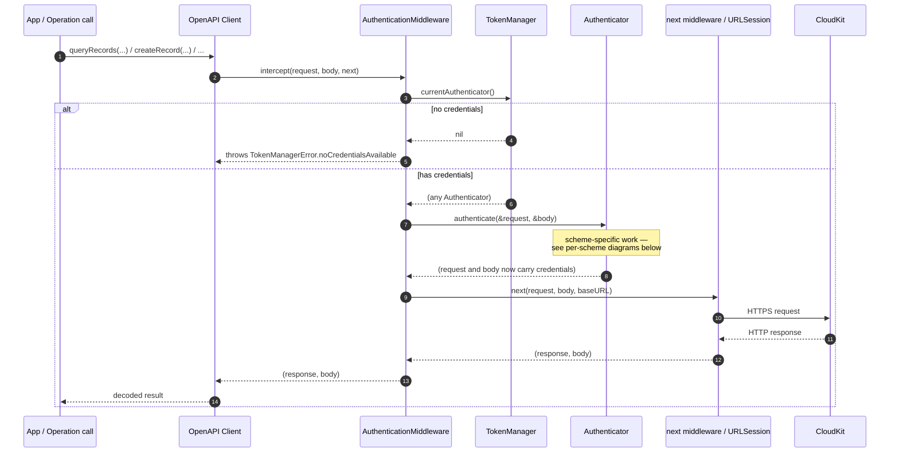
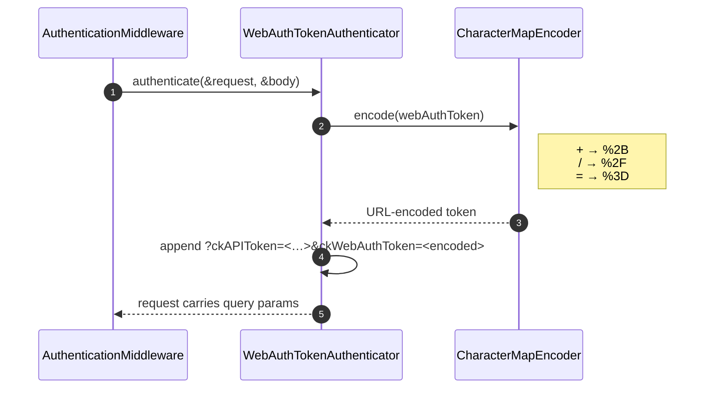
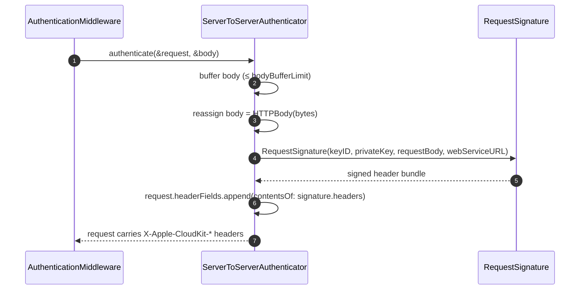
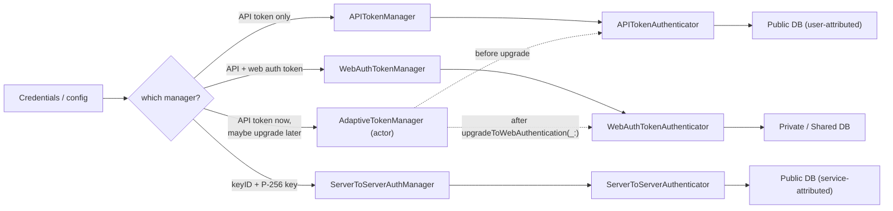

# Authentication Middleware

MistKit's authentication system uses an HTTP middleware pattern to transparently sign every request with the correct credentials, supporting three authentication methods and runtime upgrades between them.

## TokenManager Protocol

A `TokenManager` is the lifecycle owner of credentials (loading, validating, rotating, persisting). It vends an `Authenticator` to whomever needs to apply those credentials to an outgoing request:

```swift
public protocol TokenManager: Sendable {
  var hasCredentials: Bool { get async }
  func validateCredentials() async throws(TokenManagerError) -> Bool
  func currentAuthenticator() async throws(TokenManagerError) -> (any Authenticator)?
}
```

Concrete managers include `APITokenManager`, `WebAuthTokenManager`, `ServerToServerAuthManager`, and the runtime-upgradable `AdaptiveTokenManager`.

## Authenticator Protocol

Each concrete `Authenticator` (`APITokenAuthenticator`, `WebAuthTokenAuthenticator`, `ServerToServerAuthenticator`) owns both the credential payload and the rule for attaching it to a request:

```swift
public protocol Authenticator: Sendable {
  static var storageKey: String { get }
  var defaultStorageIdentifier: String { get }
  init(decoding data: Data) throws
  func authenticate(request: inout HTTPRequest, body: inout HTTPBody?) async throws
  func encoded() throws -> Data
}
```

Bundling the credential with the application logic keeps new authentication schemes from rippling into the middleware: any `Authenticator` can be plugged in without changes elsewhere.

### Why `body: inout HTTPBody?`

`HTTPBody` is a single-pass async sequence. `ServerToServerAuthenticator` has to read every byte to compute the SHA-256 over the body — and that consumes the iterator. The authenticator buffers those bytes, then reassigns `body = HTTPBody(bytes)` so downstream middleware sees a fresh, replayable copy of the same data. The protocol's `inout` parameter exists to allow that reassignment. The other authenticators don't actually mutate `body`, but the protocol signature has to accommodate the one that does.

## The Middleware Intercept

`AuthenticationMiddleware` conforms to the OpenAPI `ClientMiddleware` protocol and intercepts every outgoing request. The middleware itself is trivial — it asks the token manager for the current authenticator and lets the authenticator apply itself:

```swift
internal func intercept(
  _ request: HTTPRequest,
  body: HTTPBody?,
  baseURL: URL,
  operationID: String,
  next: (HTTPRequest, HTTPBody?, URL) async throws -> (HTTPResponse, HTTPBody?)
) async throws -> (HTTPResponse, HTTPBody?) {
  guard let authenticator = try await tokenManager.currentAuthenticator() else {
    throw TokenManagerError.invalidCredentials(.noCredentialsAvailable)
  }

  var modifiedRequest = request
  var modifiedBody = body
  try await authenticator.authenticate(request: &modifiedRequest, body: &modifiedBody)
  return try await next(modifiedRequest, modifiedBody, baseURL)
}
```

The per-scheme branching — query parameter for API token, two query parameters for web auth, signed headers for server-to-server — lives inside each concrete `Authenticator.authenticate(request:body:)` implementation.

## API Token Authentication

The simplest method — appends a query parameter:

```
GET /database/1/iCloud.com.example/development/public/records/query?ckAPIToken=abc123...
```

- Token is a 64-character hex string identifying the container.
- Grants **public database** access only.
- Validated via regex: `^[a-f0-9]{64}$`

## Web Auth Token Authentication

Adds a second query parameter for user-specific operations:

```
GET ...?ckAPIToken=abc123...&ckWebAuthToken=encoded-token
```

The web auth token is URL-encoded via `CharacterMapEncoder`:

```swift
// CharacterMapEncoder replaces URL-unsafe characters:
//   + → %2B
//   / → %2F
//   = → %3D
let encoded = tokenEncoder.encode(webToken)
```

This grants access to **private and shared databases** for the authenticated user.

## Server-to-Server (ECDSA P-256) Authentication

Used for backend services without user interaction. `ServerToServerAuthenticator.authenticate(request:body:)` does the work:

1. **Buffer the request body** (up to `bodyBufferLimit`, default 1 MiB), and reassign `body` to the buffered copy so downstream middleware sees the same bytes the signature covers.
2. **Build a `RequestSignature`** — this initializer does the signing.
3. **Append the resulting `HTTPFields`** to `request.headerFields`.

```swift
public func authenticate(
  request: inout HTTPRequest,
  body: inout HTTPBody?
) async throws {
  let bodyData: Data?
  if let original = body {
    let bytes = try await Data(collecting: original, upTo: bodyBufferLimit)
    body = HTTPBody(bytes)
    bodyData = bytes
  } else {
    bodyData = nil
  }

  let signature = try RequestSignature(
    keyID: keyID,
    privateKey: privateKey,
    requestBody: bodyData,
    webServiceURL: request.path ?? ""
  )

  request.headerFields.append(contentsOf: signature.headers)
}
```

### RequestSignature

`RequestSignature` is the value type that holds a signed header bundle:

```swift
public struct RequestSignature: Sendable {
  public let keyID: String
  public let iso8601DateString: String          // exact string that was signed
  public let signatureDerRepresentation: Data   // DER bytes
  public var signatureBase64: String { ... }    // wire form, derived on demand
  public var headers: HTTPFields { ... }        // typed headers, ready to append
}
```

It's a transport-format value, not a domain value:

- **`iso8601DateString` is stored as String, not Date.** The ISO 8601 string is part of the signed payload — re-formatting a `Date` on every header access would risk a wire string that differs from what was signed (formatter options, locale, fractional seconds). Storing the string locks the wire form to the signed form.
- **`signatureDerRepresentation` is stored as Data, not String.** The ECDSA signature is naturally bytes. The base64 form is computed on demand via `signatureBase64` so the type doesn't carry a redundant encoding, and the struct stays free of the `@available` constraints that come with `P256.Signing.ECDSASignature`.

### Signing process

The convenience initializer `init(keyID:privateKey:requestBody:webServiceURL:date:)` does:

1. **Format the ISO 8601 date.** On macOS 12 / iOS 15 / tvOS 15 / watchOS 8 and later, `Date.ISO8601FormatStyle` (Sendable value type). On older OSes, a `nonisolated(unsafe)` cached `ISO8601DateFormatter` (documented thread-safe for `string(from:)`).
2. **Hash the body.** `SHA256.cloudKitBodyHash(of: body)` returns `base64(SHA256(body))`, or the empty string when the body is `nil` — matching CloudKit's no-body convention.
3. **Build the signing payload:** `"<iso8601Date>:<bodyHash>:<webServiceURL>"`
4. **Sign with P-256.** `privateKey.signature(for: Data(payload.utf8))` → DER bytes.
5. **Delegate to the storage init**, capturing `iso8601DateString`, `signatureDerRepresentation`, and `keyID`.

A second initializer — `init(keyID:privateKey:bodyHash:webServiceURL:iso8601DateString:)` — takes the pre-formatted strings directly. It's the core signing path (no formatting, no hashing); the convenience init delegates to it. Useful for deterministic testing or when the caller already has those values.

### Wire format

The three headers appended to the request:

```http
X-Apple-CloudKit-Request-KeyID: <keyID>
X-Apple-CloudKit-Request-ISO8601Date: 2026-05-15T14:30:00Z
X-Apple-CloudKit-Request-SignatureV1: <base64-of-DER-signature>
```

`HTTPField.Name` constants for these live in `Sources/MistKit/Utilities/HTTPField.Name+CloudKit.swift`.

## AdaptiveTokenManager & `upgradeToWebAuthentication`

`AdaptiveTokenManager` is an **actor** that enables runtime transitions between auth methods. It vends an `APITokenAuthenticator` while API-only and switches to a `WebAuthTokenAuthenticator` once upgraded:

```swift
public actor AdaptiveTokenManager: TokenManager {
  internal let apiToken: String
  internal var webAuthToken: String?
  internal let storage: (any TokenStorage)?

  public func currentAuthenticator() async throws(TokenManagerError) -> (any Authenticator)? {
    if let webToken = webAuthToken {
      return try WebAuthTokenAuthenticator(apiToken: apiToken, webAuthToken: webToken)
    }
    return try APITokenAuthenticator(token: apiToken)
  }

  @discardableResult
  public func upgradeToWebAuthentication(
    webAuthToken: String
  ) async throws(TokenManagerError) -> WebAuthTokenAuthenticator {
    let authenticator = try WebAuthTokenAuthenticator(
      apiToken: apiToken,
      webAuthToken: webAuthToken
    )
    self.webAuthToken = webAuthToken

    if let storage = storage {
      // Don't fail the upgrade if storage fails — just log.
      try? await storage.store(authenticator, identifier: apiToken)
    }

    return authenticator
  }
}
```

`WebAuthTokenAuthenticator`'s initializer is what validates the token (empty / too-short tokens throw `TokenManagerError.invalidCredentials`), so the manager doesn't duplicate that logic. The companion `downgradeToAPIOnly()` and `updateWebAuthToken(_:)` methods live alongside on `AdaptiveTokenManager+Transitions`.

A typical client-app flow:

1. App starts with **API token only** → can query public database.
2. User authenticates via CloudKit's web auth flow → receives web auth token.
3. App calls `upgradeToWebAuthentication(webAuthToken:)` → all subsequent requests include the user's token.
4. App can now access **private database** operations.

The actor ensures thread-safe state mutation; the optional `TokenStorage` lets credentials survive across app launches.

## Per-Call Attribution: `PublicAuthPreference`

Public-database operations can be attributed either to a service account (server-to-server / ECDSA P-256) or to an end user (API token + web auth). The caller picks per-call via `Database.public(_:)`:

```swift
public enum Database {
  case `public`(PublicAuthPreference)
  case `private`
  case shared
}
```

- `.prefers(.serverToServer)` — try S2S, fall back to web-auth/API-token if S2S isn't configured.
- `.prefers(.webAuth)` — try web-auth, fall back to S2S.
- `.requires(.serverToServer)` — must use S2S, otherwise throw `missingCredentials(.preferenceRequired)`.
- `.requires(.webAuth)` — must use web-auth, otherwise throw.

There is **no default** — every public-database call picks explicitly. User-context routes (`/users/*`) pass `.public(.requires(.webAuth))` directly because CloudKit only accepts web-auth on those endpoints. Private and shared databases ignore this — they always require web-auth, since CloudKit rejects S2S on those scopes.

See `Sources/MistKit/Authentication/PublicAuthPreference.swift` and `Sources/MistKit/Authentication/Credentials/Credentials+TokenManager.swift` for the resolution logic.

## Complete Authentication Flow

The shared middleware pipeline is the same regardless of scheme — the per-scheme work happens inside `Authenticator.authenticate(request:body:)`, expanded in the diagrams that follow.



### API Token Flow

The `APITokenAuthenticator` branch is a single mutation — it appends `?ckAPIToken=<64-hex>` to the request URL and returns. No body buffering, no async work.

### Web Auth Flow

`WebAuthTokenAuthenticator` URL-encodes the user-specific token via `CharacterMapEncoder` before appending it as a second query parameter alongside the API token:



### Server-to-Server (ECDSA P-256) Flow

`ServerToServerAuthenticator` buffers the body so it can be hashed, builds a `RequestSignature`, and appends the three `X-Apple-CloudKit-*` headers:



### Token Manager Selection


